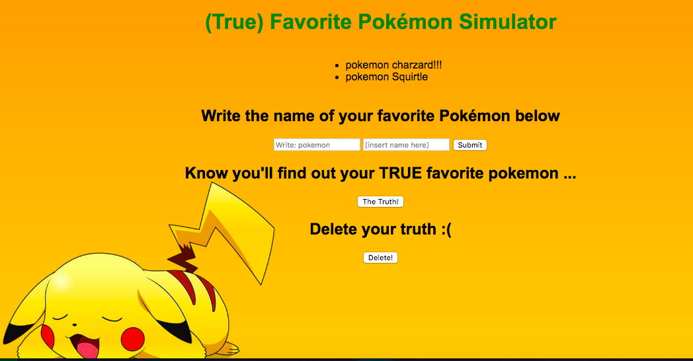

## Installation

1. Clone repo
2. run `npm install`

## Usage

1. run `npm run savage`
2. Navigate to `localhost:8080`

## Explanation

In this Express App, I used CRUD functionalities to have users type in
their favorite pokémon, and then it replaces their entry with what I
believe their favorite pokémon should be.
